# Phase 1 用户时序

本文画人怎么用 red-bucket。端点、状态码、JSON 字段以 `api-catalog.md` 为准。表与锁以 `schema-sqlite.md` 为准。实现栈见 `tech-stack.md`。

图里的「服务」是同一个 FastAPI 进程：它后面再碰 SQLite、git、formatter。浏览器 HTML 与 JSON 客户端走同一套 `/api/v1/`。日后 CLI、移动端、MCP 只是换一个最左列的调用方，不另开时序。

三个名字在图里也不混用：copy 是写入自己的桶；install-script 是拿一段本机 shell；translated fetch 是按 harness 取译本。

## 谁参与

- 访客：未带 token。
- 本人：已登录的 owner。
- 他人：已登录，但不是该桶 owner。
- 本机 agent：执行安装脚本的本地环境（curl 或 shell）。
- 服务：red-bucket 进程。
- SQLite、git、formatter：服务内部，不是用户能直接打的面。

## 入口总览

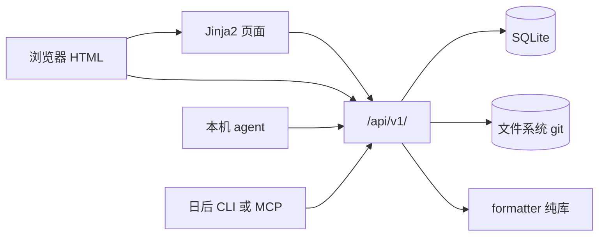

## 1. 注册、登录、看自己

访客先注册。注册成功不签发 token。再登录拿到 Bearer。之后写操作都带这个头。

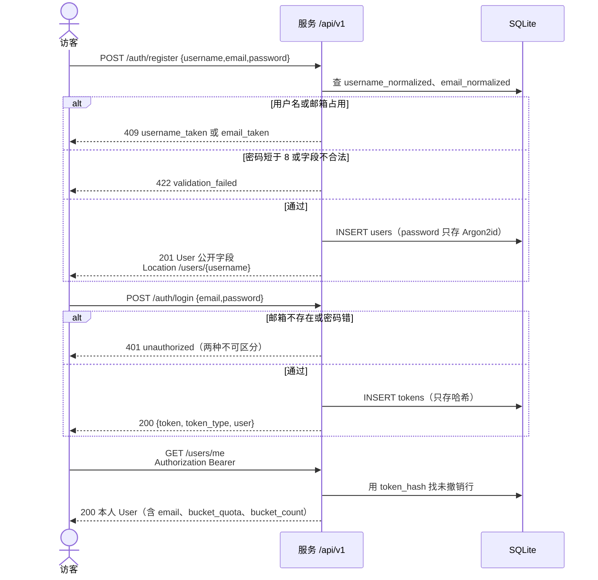

## 2. 从模板创建 bucket

本人在自己的命名空间下建桶。选了 template 才有第一次 git commit。

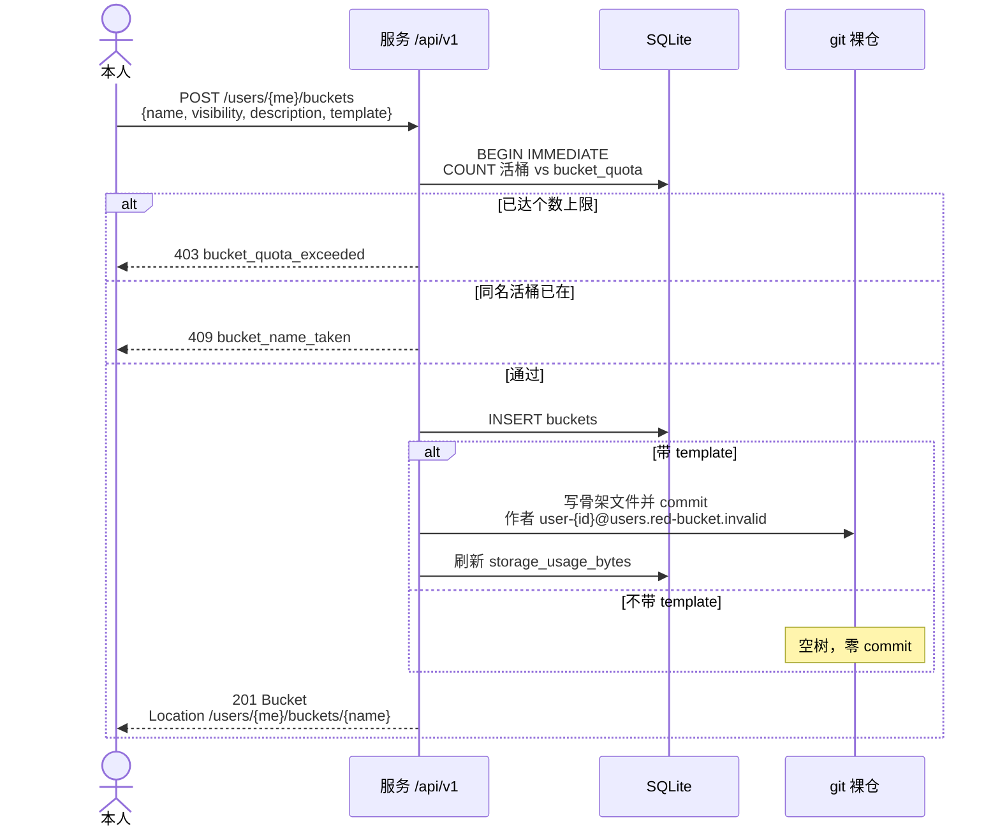

## 3. 上传资产

上传、copy、PR merge 走同一条校验再加配额的路径。

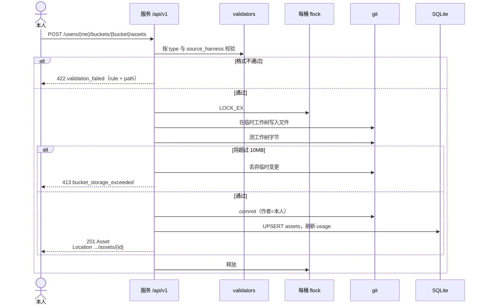

## 4. 匿名浏览公开桶，再按 harness 翻译拉取

核心价值在这一条：读可以不登录；译本由 formatter 现算，不改 git 里的源。

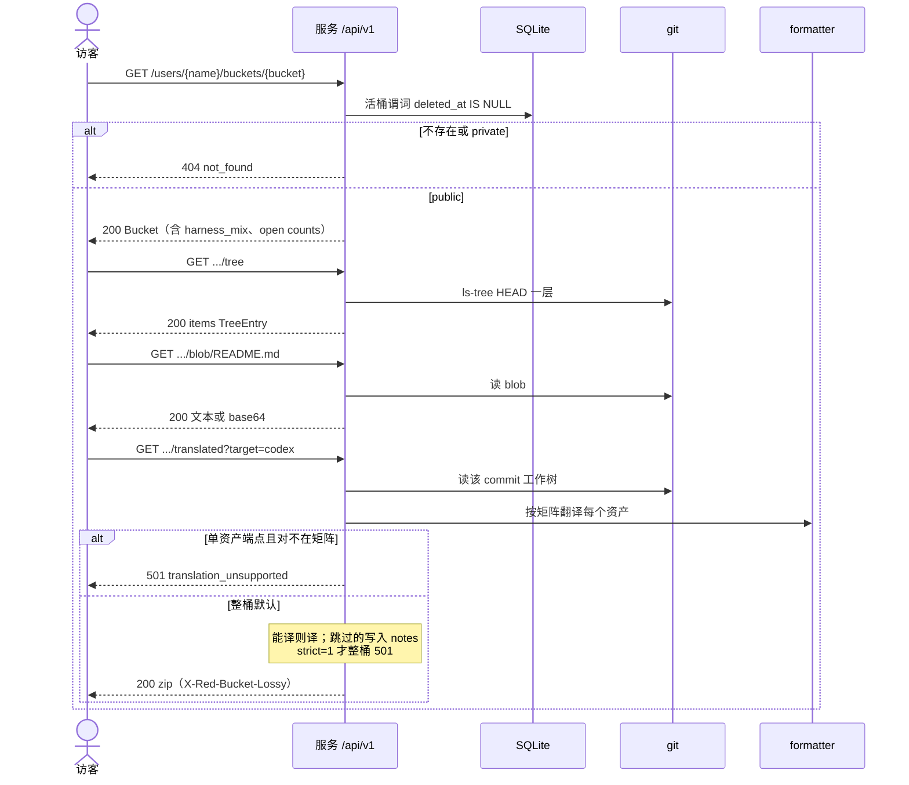

## 5. 本机执行安装脚本

用户从 Code 页签复制脚本。agent 在干净环境执行。脚本只打公开 GET，先取译本再落盘。这不是 copy。

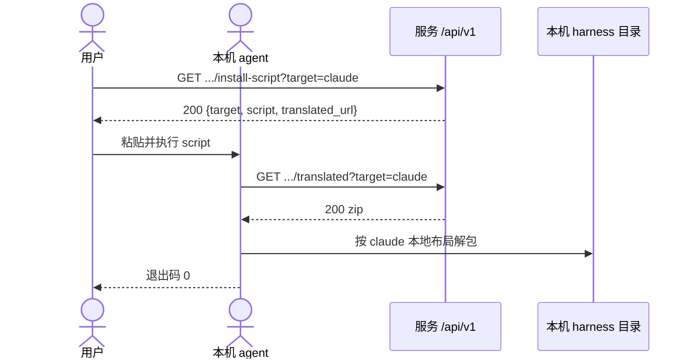

## 6. 把别人的公开资产复制进自己的桶

本人读得到源（公开，或自己的私有），写进自己的目标桶。留下 copies 出处。

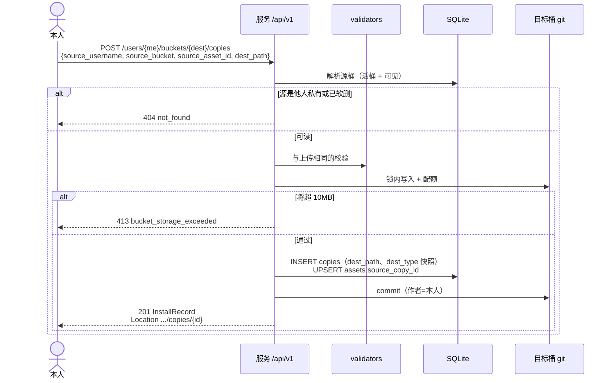

## 7. 他人在公开桶开 issue 并评论

第三人不能评、不能关。私有桶对非 owner 一律 404。

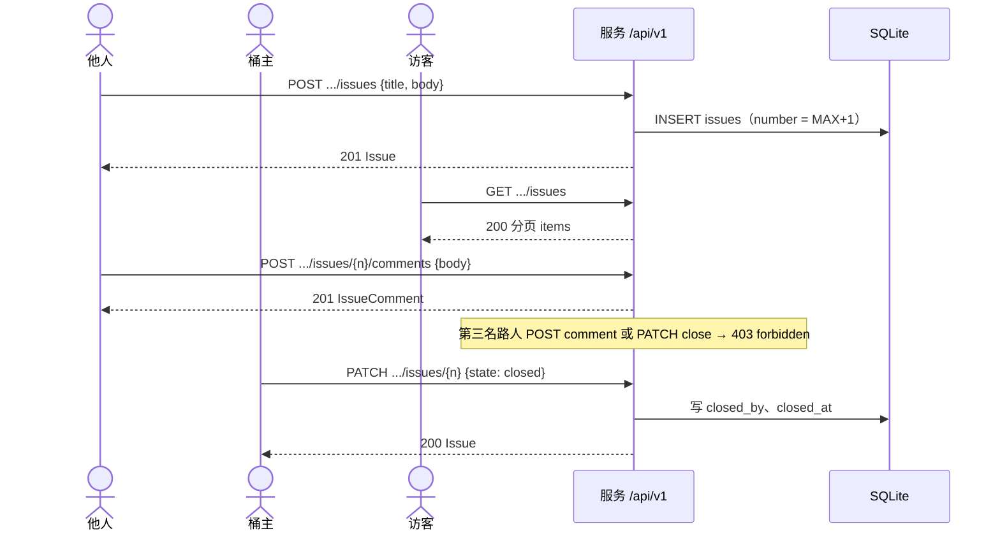

## 8. 他人提 PR，桶主 merge

提议内容是文件树替换列表，先躺在 SQLite，merge 时才进 git。校验与配额必须重跑。

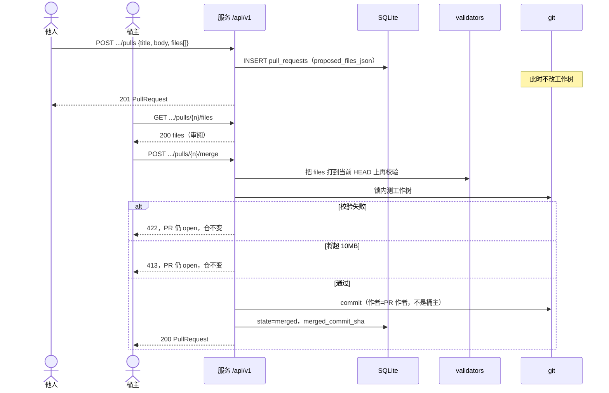

桶主拒绝则 `POST .../reject`，状态变 rejected，git 不动。

## 9. 登出

只撤销当前这一枚 token。

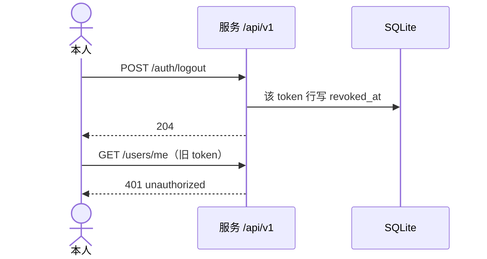

## 10. 非 owner 撞上私有桶

存在与否对外不可区分。列表里私有项是省略，不是逐条 404。

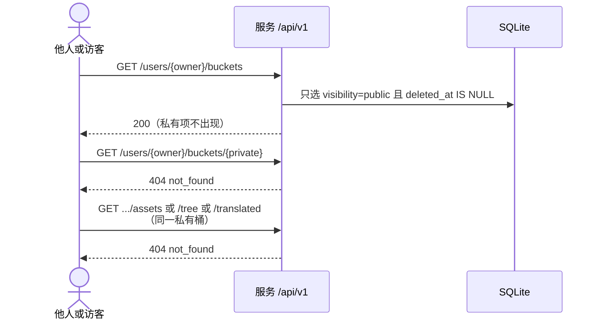

## 11. 改用户名（元数据，仓不搬家）

用来满足 git-storage 的 rename-safe。不是产品级改名页的完整设计。

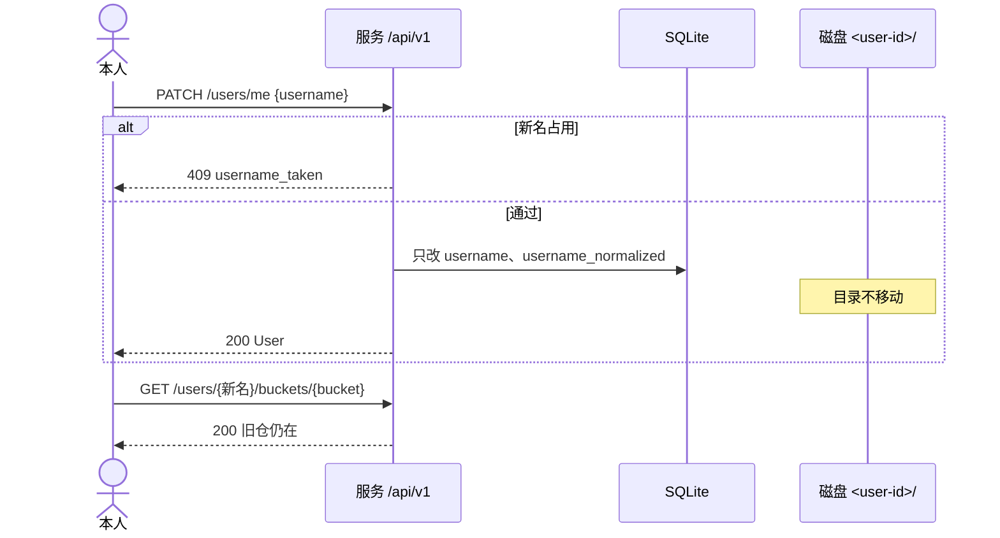

## 和 Web UI 的关系

浏览器打开 `/<username>/<bucket>` 时，服务先渲染 HTML（标题、页签、文件表、About、安装脚本文本都在首屏 HTML 里，满足无 JS）。页面上的写操作（建桶、上传、关 issue、merge）再打上图同一组 `/api/v1/` 端点。不要为页签再做一套私有 JSON。

## 不画进本期的时序

- 移动应用上架后的安装与推送。
- `git clone` 协议。
- 官方第一方 skill 或 MCP 客户端本体（它们将来复用第 4、5、6 节）。
- 市场浏览、Star、协作者邀请。
